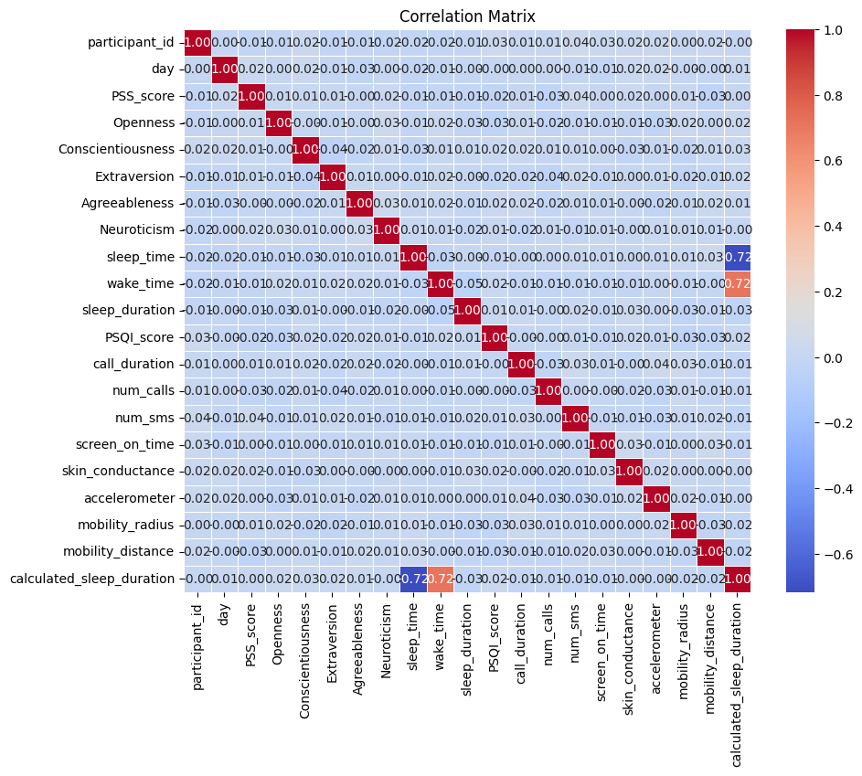
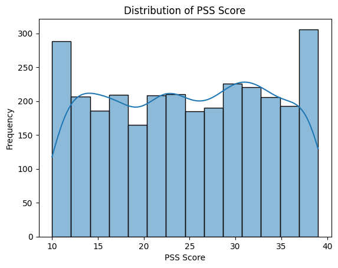

# Stress Detection Data Analysis

This project analyzes the **Stress Detection Dataset** to explore how behavioral, psychological, and physiological factors relate to perceived stress levels.  
It was developed as part of my **DATA 219 coursework at WSU Vancouver**, and it demonstrates my ability to perform data cleaning, statistical analysis, visualization, and performance-efficient computation in Python.

---

## Project Overview
The dataset includes participant-level data with **3,000 rows and 20 columns**, containing both numerical and categorical variables related to stress detection.

### Key Attributes:
- **PSS Score (Perceived Stress Scale)** – measure of perceived stress  
- **Personality Traits** – Openness, Conscientiousness, Extraversion, Agreeableness, Neuroticism  
- **Sleep Metrics** – duration, efficiency, PSQI score  
- **Phone Usage** – number of calls, SMS, and screen-on time  
- **Biometric Data** – skin conductance, accelerometer readings  
- **Mobility Metrics** – distance and radius of daily movement  

Dataset source: [Kaggle – Stress Detection Dataset](https://www.kaggle.com/datasets/swadeshi/stress-detection-dataset)

---

## Research Question
> How do **sleep efficiency** and **screen-on time** impact stress levels, and can we efficiently rank participants with the highest stress levels?

**Objectives:**
- Identify correlations between behavioral patterns and stress  
- Rank participants by their stress scores using efficient data structures  
- Compare performance of NumPy arrays vs. heap-based approaches  

---

## Data Cleaning & Preparation
Steps performed before analysis:
1. **Handled missing and invalid values** – replaced placeholders (`-1`, `9999`) with median or mode values.  
2. **Standardized columns** – ensured consistent time formats and measurement units.  
3. **Feature Engineering** – created new metric *Sleep Efficiency* = sleep_duration / (wake_time - sleep_time).  
4. **Normalization** – standardized columns like skin_conductance and accelerometer readings.  
5. **Validation** – verified logical consistency of features like mobility_distance and PSS_score.  

---

## Methods & Implementation
**Data Structures Used:**
- **NumPy Array** – for correlation computations and feature normalization  
- **Heap (heapq)** – for dynamically ranking top participants by PSS score or screen-on time  

**Operations:**
- Manual computation of Pearson correlation coefficient  
- Comparison of array-based vs. heap-based ranking efficiency  
- Performance testing at different dataset sizes  

---

## Visual Insights

### Correlation Matrix
Displays weak-to-moderate relationships among behavioral and physiological metrics.

---

### Distribution of PSS Score
Shows a broad spread of stress levels among participants, indicating a well-balanced dataset.

---

## Results Summary
| Metric | Correlation with Stress (PSS) |
|--------|-------------------------------|
| Sleep Duration | -0.015 |
| Screen-On Time | +0.004 |
| Sleep Duration ↔ Screen-On Time | -0.006 |

**Top 10 Participants by Stress (via Heap Ranking):**
ID: 81 | PSS: 39
ID: 71 | PSS: 39
ID: 48 | PSS: 39
ID: 84 | PSS: 39
ID: 38 | PSS: 39
ID: 51 | PSS: 39
ID: 5 | PSS: 39
ID: 18 | PSS: 39
ID: 8 | PSS: 39
ID: 93 | PSS: 39

---

## Tools & Libraries
- **Python 3.11**  
- **NumPy** – array computations  
- **Pandas** – data manipulation and cleaning  
- **Matplotlib / Seaborn** – visualization  
- **heapq** – efficient ranking structure  
- **Jupyter Notebook** – interactive analysis  

---

## Repository Structure
stress-detection/
│
├── data/
│ └── stress_detection.csv
│
├── notebooks/
│ └── Final219Analysis.ipynb
│
├── results/
│ └── figures/
│ ├── correlation_matrix.png
│ └── pss_distribution.png
│
├── docs/
│ ├── Part 1 - Andrew Lal.pdf
│ ├── Part 2 - Andrew Lal.pdf
│ ├── Part 3 - Andrew Lal.pdf
│ ├── DATA 219 Final Summary - Andrew Lal.pdf
│ └── Stress_Detection_Dataset.pdf
│
├── requirements.txt
└── README.md

---

## Future Improvements
This project currently focuses on exploratory data analysis and algorithmic efficiency.  
Potential next steps:
- Build a **predictive model** (e.g., logistic regression, random forest) to classify stress levels  
- Apply **feature selection** to identify top stress predictors  
- Add **interactive visualizations** using Plotly or Dash  
- Extend the dataset with **real-time physiological data** for temporal stress tracking  

---

## Author
**Andrew Lal**  
B.S. in Data Analytics — Washington State University Vancouver  
[LinkedIn](https://www.linkedin.com/in/andrew-lal-99287320b/)  
andrew.lal@wsu.edu  

---

## License
This project is open-source under the [MIT License](LICENSE).

Add project README
